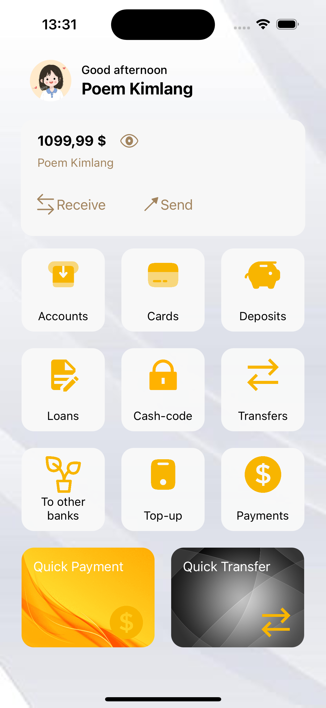

🏦 Advanced CollectionView Move Cell (MVVM + Compositional Layout)

A fully functional UIKit demo app using Compositional Layout + MVVM pattern.
Supports drag-and-drop reordering by section, dynamic headers, and modern iOS UI.

✨ Features

🔹 MVVM Architecture – clear separation of view, model, and logic for easy scalability.

🔹 Compositional Layout – flexible section-based layouts (Header, Accounts, Quick Payment).

🔹 Drag & Drop Reordering – move collection cells within sections using UILongPressGestureRecognizer.

🔹 Dynamic Header – displays user profile, greeting message, and name.

🔹 Background Support – full-screen background image behind collection content.

🔹 Animated Edit Mode – “wiggle” animation for active cells during drag operation.

🔹 Reusable Components – each section uses independent NSCollectionLayoutSection from HomeLayout.swift.
MVVM Structure
│
├── HomeVC.swift          → ViewController handling UI and gestures
├── HomeVM.swift          → ViewModel supplying section data
├── HomeModel.swift       → Model definitions (Header, Account, QuickPayment)
├── HomeLayout.swift      → Compositional layout builder for each section
└── Cells/
     ├── HeaderCell.swift
     ├── AccountCell.swift
     └── QuickPaymentCell.swift
| Section       | Description                        | Layout Type            |
| ------------- | ---------------------------------- | ---------------------- |
| Header        | Profile, greeting, balance info    | Full-width single item |
| Account       | List of banking features           | 3-column grid          |
| Quick Payment | Quick transfer & payment shortcuts | 2 horizontal items     |
🖐️ Interactive Cell Movement

Cells in the Account or Quick Payment sections can be reordered by long-pressing and dragging:

let gesture = UILongPressGestureRecognizer(target: self, action: #selector(handleLongPressGesture))
collectionView.addGestureRecognizer(gesture)
Movement is limited within the same section to preserve logical grouping.

💡 Technologies Used

UIKit

UICollectionViewCompositionalLayout

UILongPressGestureRecognizer

Auto Layout (programmatic)

Swift 5

iOS 13.0+ Deployment Target

🚀 Getting Started

Clone the repository:

git clone https://github.com/PoemKimlang/AdvanceCollectionViewMoveCell.git

Run the project on simulator or device.
🧾 License

This project is open-sourced under the MIT License.
Feel free to modify and use in your own projects.
## 📱 App Preview

  

